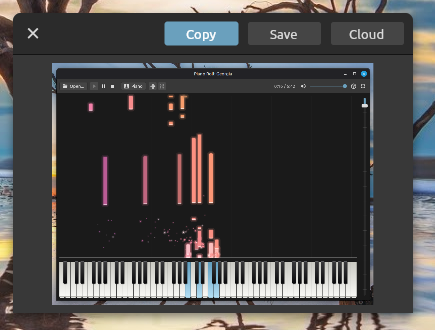

# Screen Grab

Screen Grab is a utility for Linux Mint, Ubuntu and compatible operating systems that fixes a few problems with the built in Print Screen program. The first annoyance it fixes is that you can take a screenshot while a menu is open. When I was trying to take a screenshot of GIMP, I found that the Print Screen key wouldn't work while the File menu was showing. Since I was trying to fix something in the File menu, this was a problem.

The second thing it fixes is that I often want to send a screenshot to collaborators in a chat window. Screen Grab can upload screenshots to cloud storage and give you a link to share.

Finally, it lets you capture a specific rectangle instead of always capturing the entire screen. I found myself always going into GIMP to crop my screenshots. Now I don't need to.



Built with .NET 8 and [Avalonia](https://avaloniaui.net/), for Linux X11 sessions such as Linux Mint Cinnamon.

## Why Print Screen fails while a menu is open

Desktop shortcuts such as Cinnamon's Print Screen are *passive key grabs*: the window manager asks the X server to send it that key whenever it's pressed. When a program opens a menu, it takes an *active grab* of the keyboard and mouse, so every key goes to that program until the menu closes (that's how a click outside a menu closes it). An active grab beats the passive ones, so the menu gets Print Screen, ignores it, and the desktop never sees it.

Screen Grab doesn't register a shortcut. It listens for **XInput 2 raw key events** on the root window, which the X server sends to every program that asks for them, grab or no grab (XInput 2.1 and later). When the hotkey goes down, it reads the screen straight away with `XGetImage`, on its own connection and thread, before anything else can happen, so the open menu is in the picture. Grabs only decide who gets input; any program can still read the screen.

## How a screenshot works

1. **Press Print Screen.** The whole screen (every monitor) is captured at that moment, open menus included.
2. **Select an area.** The screenshot fills the screen, exactly over the desktop (the panel included), covered with 50% black. Drag to draw a rectangle: inside it the picture shows undimmed, with a 2px dashed border and its size beside it. The pixel under the pointer is included, so a drag from corner to corner selects the whole screen (all 1920 × 1080 of a 1920 × 1080 screen).
   * Press within 10 pixels of an edge or corner to resize the rectangle along that edge or corner.
   * Press anywhere else to start a new rectangle; the old one goes.
   * Arrow keys nudge it (Shift for 10 pixels) and Ctrl+A selects everything.
3. **Press Enter** to capture the selected area (or the whole screen, if nothing is selected). **Escape** cancels.
4. **Copy, save or upload.** A 400 × 300 window shows what was captured (shrunk to fit if it's bigger, never enlarged). It draws its own title bar (see Notes), with three buttons on the right, which turn green under the mouse:
   * **Copy** (Ctrl+C): to the clipboard.
   * **Save** (Ctrl+S): choose a file; `.png`, `.jpg` or `.gif`.
   * **Cloud**: upload it to Amazon S3 (below).

   The round button on the left, or Escape, closes the window. Drag the title bar to move it.

If a menu was open when you pressed Print Screen, that program still holds the mouse and keyboard until its menu closes, so the first click just closes the menu (it's still in the screenshot); drag after that.

## Uploading to Amazon S3

**Cloud** opens the **Cloud** window: choose the format (PNG, GIF or JPG) and the file name (the date and time to start with), then **Upload**. The line below shows where it will go (`s3://bucket/folder/name.png`); if a file with that name is already there, you're asked before it's replaced. When the upload is done, the file's link is copied to the clipboard and opened in your default browser, and the window closes. To copy the link again later, select the capture in the main window and click **Copy link**; the link is kept for as long as the capture is in the list, between sessions too.

The link uses the bucket's CloudFront domain when a CloudFront distribution serves the bucket (its alternate domain name, such as `https://images.example.com/folder/name.png`, or else its `dxxxx.cloudfront.net` name, allowing for the distribution's origin path), found the same way S3 File Explorer finds it. Otherwise it's the S3 URL (`https://bucket.s3.region.amazonaws.com/folder/name.png`).

Uploads are public: each file is stored with the canned ACL `public-read`, so its link works for anyone, whether it's the S3 URL or a CloudFront distribution reading the bucket as a public origin. The bucket must allow that: ACLs turned on (Object Ownership isn't "bucket owner enforced") and Block Public Access not blocking public ACLs, for the bucket or the account. If it doesn't, the upload window says which setting is in the way.

The gear button, to the left of **Upload** in the title bar, opens **Settings**, with **Cancel** and **OK** in its title bar. It sets your AWS access key ID and secret access key, the region, the bucket (type it, or **Choose** from the buckets your keys can see) and the folder in it. They're kept encrypted (AES 256 in GCM mode) in `~/.config/screengrab/s3.dat`, with the key in `s3.key` beside it, both readable only by you, the same way S3 File Explorer keeps its profiles. The format you last uploaded is remembered.

The keys need `s3:PutObject` and `s3:PutObjectAcl` on the folder; `s3:GetObject` (to check for an existing file), `s3:ListAllMyBuckets` (for **Choose**), `s3:GetBucketLocation` and `cloudfront:ListDistributions` (for CloudFront links) are used when allowed. **Delete everywhere** in the main window needs `s3:DeleteObject`, and `cloudfront:CreateInvalidation` to clear CloudFront's cache.

## Features

* **A hotkey that always works**: Print Screen, or Shift, Ctrl, Alt or Super with Print Screen. It works while menus, dropdown lists and drags are in progress, and only listens: the key still goes wherever it would have gone.
* **Every monitor**: the screenshot covers the whole desktop. **Select screen** selects one monitor's part of it.
* **Uploading to S3**, with the file's link (on the bucket's CloudFront domain when it has one) copied to the clipboard and opened in the browser.
* **The main window** keeps your latest captures and can select, copy and save again: drag on a capture to select part of it (drag inside the rectangle to move it), then Copy, Save or Save as. **Copy link** copies the link to a capture's last upload to S3.
* **Copy and save**: the clipboard gets a PNG. Files can be PNG, JPG (quality 92) or GIF; a GIF keeps a screenshot's exact colours when it has 256 or fewer, and otherwise gets the best 256 (median cut). **Save** in the main window saves a PNG in the save folder, named with the date and time.
* **Delayed screenshots**: hide the window, wait a few seconds (1 to 60), then take the screenshot and select as above.
* **Mouse pointer**: optionally drawn into the screenshot.
* **Zoom**: fit the screenshot in the window, or 100%; Ctrl+wheel zooms from 12.5% to 800% around the pointer, with sharp pixels from 100% up.
* **Recent captures**: the last 12, with thumbnails, down the right of the main window, kept between sessions. The trash button (Delete) removes one from the list; **Delete everywhere** beside it (Shift+Delete) also deletes every file it was saved to and every upload to S3, after asking.
* **System tray**: Screen Grab starts in the tray, without the window; click the tray icon (or start it again) to show it. Closing the window leaves Screen Grab in the tray, listening for the hotkey. The tray menu takes screenshots and quits.
* **Cinnamon's shortcuts**: Cinnamon uses every Print Screen combination for its own screenshots, so without a menu open both programs would take one. Preferences shows when the hotkey clashes and can take the shortcut from Cinnamon, and give it back later.
* **Start at login**, in the tray.
* **One copy at a time**: starting Screen Grab again shows the copy that's already running.
* **Command line**: `screengrab --capture` saves one screenshot and exits.

## Requirements

* Linux with an **X11 session**, which is Linux Mint's default. Wayland isn't supported: there, programs aren't allowed to read the screen or watch the keyboard like this.
* XInput 2.1 or later (any X server from the last decade) and the X libraries `libX11`, `libXi` and `libXfixes`, which every X11 desktop has.
* The [.NET 8 SDK](https://dotnet.microsoft.com/download/dotnet/8.0) to build it. On Linux Mint: `sudo apt install dotnet-sdk-8.0`.

## Build and run

```sh
cd screengrab
dotnet build
dotnet run
```

### Standalone builds

To make a self contained program that runs without .NET installed:

```sh
dotnet publish -c Release -r linux-x64 --self-contained -o publish/linux-x64
```

Run `screengrab` from the output folder. The version shown in the About screen comes from `<Version>` in `screengrab.csproj`.

### Installing on Linux

`publish-linux.sh` publishes a build to `~/.local/share/screen-grab` and adds Screen Grab, with its icon, to the Mint menu (and other desktop menus) under Graphics and Accessories:

```sh
./publish-linux.sh
```

## Setting it up

1. Install it with `./publish-linux.sh` (see above), start it, click its tray icon to show the window, and tick **Start Screen Grab when I log in** in **Preferences** (the cog).
2. In Preferences, if it says Cinnamon also uses the hotkey, select **Stop Cinnamon using it**, so Print Screen goes to Screen Grab alone. (Or choose **Super+Print Screen**, which Cinnamon doesn't use.)
3. Closing the window leaves Screen Grab in the tray; **Quit** in the tray menu (or Ctrl+Q in the window) stops it.

In the main window:

| Key | Does |
| --- | --- |
| Print Screen (or your hotkey) | Take a screenshot, anywhere |
| Ctrl+N | Take a screenshot (hides the window first, then select as usual) |
| Ctrl+C | Copy the selection, or the whole screenshot |
| Ctrl+S / Ctrl+Shift+S | Save as PNG in the save folder / Save as PNG, JPG or GIF |
| Ctrl+A / Escape | Select everything / clear the selection |
| Arrow keys | Move the selection 1 pixel (10 with Shift) |
| Ctrl+wheel | Zoom around the pointer |
| Delete | Remove the screenshot from the list (saved files are kept) |
| Shift+Delete | Delete everywhere: every saved file, every upload to S3, and the list entry |
| Ctrl+Q | Quit |

### From the command line

```sh
screengrab --capture                  # save in the save folder, print the file name
screengrab --capture shot.jpg         # save as shot.jpg (.png, .jpg or .gif)
screengrab --capture --delay 5        # wait 5 seconds first
screengrab --capture --pointer        # include the mouse pointer
```

## Notes

* The clipboard always gets PNG; files can be PNG, JPG or GIF, chosen by the extension. The default save folder is `~/Pictures/Screenshots` (following your Pictures folder if it has moved), and files are named like `Screenshot 2026-09-28 14-32-05.png`, with ` (2)` added if that name is taken.
* On X11 the clipboard lives in the program that copied, so a copied screenshot can be pasted only while Screen Grab is running. It stays running in the tray, so that's normally no problem.
* Taking a shortcut from Cinnamon changes Cinnamon's own settings (`org.cinnamon.desktop.keybindings.media-keys`), and Screen Grab remembers what it took. **Give it back** in Preferences puts it back. You can also restore Cinnamon's defaults by hand, for example with `gsettings reset org.cinnamon.desktop.keybindings.media-keys screenshot`.
* The capture, **Cloud** and **Settings** windows draw their own title bars, in the style of Cinnamon's header bars, instead of Cinnamon's: the window's buttons sit in it, the round button on the left closes the window, and dragging the bar (between its buttons) moves it. The top corners are rounded and the bottom ones square, and each window draws its own shadow in a 20px transparent margin, as Cinnamon doesn't draw one for these windows. The corners and shadow need a compositor, which Cinnamon always has. These windows can't be resized, and aren't meant to be.
* Screenshots are kept uncompressed in memory (4 bytes a pixel), which is why the list keeps only the last 12. Between sessions they're kept as PNG files.
* Each capture's entry in `history.json` lists every file it was saved to and every upload (bucket, key and link), so **Delete everywhere** can delete them all and **Copy link** copies the latest link. After deleting an upload, it asks each CloudFront distribution serving the bucket to invalidate the file's path, so the file stops being served from CloudFront's cache; CloudFront finishes that by itself, usually within a few minutes. If the invalidation is refused, the file is still deleted from S3 and you're told the cache may show it until it expires.
* When a screenshot is taken from the window (Capture, or a delayed one), the window hides first and comes back afterwards, so it isn't in the picture.
* The full screen selection window is an *override redirect* window: the window manager leaves it alone, so it can cover every monitor and the panel. It also grabs the mouse and keyboard while it's open, because Cinnamon's panel keeps an input area of its own on top: without the grab, presses over the panel went to the panel. Avalonia doesn't expose its connection to the X server, so the grab finds it through Avalonia's internals; that's tied to Avalonia 11.3.22, and if a later Avalonia changes them, the grab is quietly skipped.

## Where things are stored

| What | Where |
| --- | --- |
| Settings | `~/.config/screengrab/settings.json` |
| S3 keys, bucket and folder (encrypted) | `~/.config/screengrab/s3.dat` and `s3.key` |
| Start at login | `~/.config/autostart/screengrab.desktop` |
| Screenshots | `~/Pictures/Screenshots/`, or the folder set in Preferences |
| The list of recent captures, with every save and upload | `~/.local/share/screengrab/history/` (`history.json` and a PNG for each) |
| One copy check | `$XDG_RUNTIME_DIR/screengrab.sock`, while it's running |

## Project layout

```
screengrab.csproj       project file (packages, version)
publish-linux.sh        Linux install into the desktop menu
src/
  Program.cs, App.axaml   startup, one-copy check, tray icon, theme and fonts
  CommandLine.cs          screengrab --capture
  Interop/                Xlib, XInput 2 and XFixes functions; override-redirect windows
  Services/               the hotkey listener (raw key events), screen capture, PNG / JPG
                          (Skia) and GIF encoders, the clipboard, S3 uploads and the
                          CloudFront lookup, the encrypted S3 settings, the list of
                          recent captures, Cinnamon's shortcuts, settings, file names,
                          start at login
  Models/                 the captured picture, history items, hotkeys, S3 settings and
                          uploads
  Controls/CaptureView.cs the zoomable screenshot with its selection rectangle
  Views/                  main window, the full-screen selection window, the capture
                          window (copy / save / cloud), Cloud (the S3 upload) and its
                          Settings, Preferences, About, confirm and message dialogs
  Themes/MintDark.axaml   the dark theme
  Helpers/                icons, tooltips, title bars that move their window, build
                          information, AWS regions
resources/              app icon, Ubuntu fonts, Material Design Icons font
images/                 screenshots for this README
```

## Packages

The same as S3 File Explorer's, apart from its data grid:

| Package | Version | For |
| --- | --- | --- |
| Avalonia, Avalonia.Desktop, Avalonia.Themes.Fluent | 11.3.22 | the user interface |
| AWSSDK.S3 | 4.0.103.3 | uploads |
| AWSSDK.CloudFront | 4.0.101.4 | CloudFront links |

SkiaSharp, which writes the PNG and JPG files, comes with Avalonia (it draws with it), so it isn't listed separately. The X11 functions are called directly from the system's `libX11`, `libXi` and `libXfixes`.

## Credits

* [Avalonia UI](https://avaloniaui.net/) (MIT)
* [SkiaSharp](https://github.com/mono/SkiaSharp) (MIT), which Avalonia already draws with
* [AWS SDK for .NET](https://github.com/aws/aws-sdk-net) (Apache 2.0): S3 for uploads, CloudFront for links
* [Material Design Icons](https://pictogrammers.com/library/mdi/) (Apache 2.0)
* [Ubuntu font family](https://design.ubuntu.com/font) (Ubuntu Font Licence 1.0)

## License

MIT; see [LICENSE](LICENSE).
